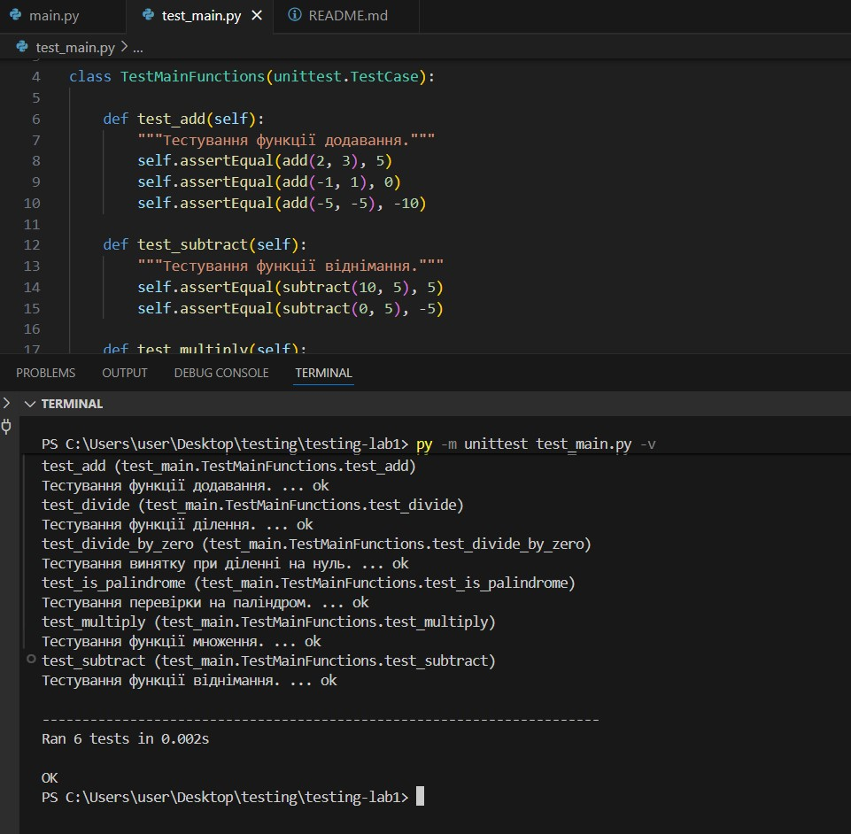

# Звіт до лабораторної роботи з тестування ПЗ

**Тема:** Загальні принципи тестування та фреймворк `unittest`  

**Виконала:** Гащук Юлія Володимирівна  

**Група:** КН-41  

---

## 1. Мета роботи

Ознайомитися з основами модульного тестування (Unit Testing) у Python за допомогою вбудованого фреймворку `unittest`. Навчитися писати тестові класи, використовувати основні методи тверджень (`assert`) та перевіряти коректність обробки помилок і винятків.

---

## 2. Структура проекту

* `main.py` — модуль з основними математичними функціями та функцією перевірки паліндромів.
* `test_main.py` — тестовий модуль з набором тестів для кожної функції.
* `README.md` — звіт про виконання лабораторної роботи.

---

## 3. Хід роботи

1. Створено новий репозиторій на GitHub та клоновано його локально.
2. Розроблено базові функції у файлі `main.py` (`add`, `subtract`, `multiply`, `divide`, `is_palindrome`).
3. Створено тестовий клас `TestMainFunctions`, що успадковує `unittest.TestCase` у файлі `test_main.py`.
4. Реалізовано перевірки із використанням `assertEqual`, `assertTrue`, `assertFalse` та `assertRaises`.
5. Проведено запуск тестів у режимі детального виводу (`-v`).

---

## 4. Результати виконання тестів

Виконання команди `python -m unittest test_main.py -v`:

test_add (test_main.TestMainFunctions.test_add)
Тестування функції додавання. ... ok
test_divide (test_main.TestMainFunctions.test_divide)
Тестування функції ділення. ... ok
test_divide_by_zero (test_main.TestMainFunctions.test_divide_by_zero)
Тестування винятку при діленні на нуль. ... ok
test_is_palindrome (test_main.TestMainFunctions.test_is_palindrome)
Тестування перевірки на паліндром. ... ok
test_multiply (test_main.TestMainFunctions.test_multiply)
Тестування функції множення. ... ok
test_subtract (test_main.TestMainFunctions.test_subtract)
Тестування функції віднімання. ... ok

----------------------------------------------------------------------
Ran 6 tests in 0.003s

OK

Скріншот проходження тестів:

## Висновки

Під час виконання лабораторної роботи було опановано фреймворк unittest. Створено тестовий набір для перевірки арифметичних обчислень, обробки винятків (ділення на нуль) та алгоритмів обробки рядків. Усі 6 тестів успішно пройшли перевірку.